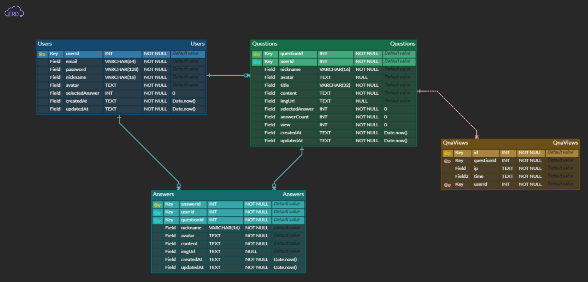

---------------------------

# ✨Q-Port (Question Port)

- **모든 궁금증과 답이 연결되어 있는 통로.**

# 📆 프로젝트 기간

- 2022/10/21 ~ 2022/10/27

# 👒 팀 소개
| 역할 | 이름 | git |
| ------ | -- | ----|
| Back-end | 왕준혁 | https://github.com/Monggle88|
| Back-end | 최원선 | https://github.com/wonsunny|
| Back-end | 장용호 | https://github.com/JangKroed|
| Front-end | 한세준 | https://github.com/hansejun|
| Front-end | 이민 | https://github.com/Pasilda123|  


# 👔 Project Architecture


# 🩳 API 명세서
[▶ Q-Port REST API 바로가기](https://www.notion.so/88eac097402442b4a0e7d54d5fc60c77?v=ce5ebdb9fb1a44dcb1842f8022d5bfd7)

# 🧦 DB 설계도(ERD)



# 👟 사용한 라이브러리(패키지)


### ✅ 백엔드에서 이미지 처리를 한 이유

- 이미지 용량 제한을 할 수 있고, DB와 S3를 연동하여 확실한 데이터 처리가 가능함. 예를 들어, 유저가 게시물을 삭제하거나 회원 탈퇴할 경우, 어떤 유저의 파일인지 추적, 처리하여 메모리 낭비를 줄이고, 데이터의 무결성을 증대할 수 있음.


### ✅ 관계형 데이터베이스(RDBMS)를 사용한 이유

- 프로젝트 구조 상 유저를 중심으로 관계를 맺는 데이터가 많기 때문에 DB indexing으로 데이터 관리를 용이하게 함.


### ✅ 왜 session이 아닌 jwt방식을 선택했을까?

- **세션 방식**은 서버의 메모리 내부에 유저의 정보를 저장함. 유저의 수가 증가할수록 세션의 양이 많아지는 만큼 메모리에 부하가 걸릴 수 있음. 실제 서비스 배포를 위한 프로젝트에서는 유저의 수가 적지 않을 거라 예상하여 **JWT 토큰 인증방식** 선택. JWT는 서버의 메모리에 저장 공간을 확보하지 않고 토큰 발급 및 확인 절차만 거치므로 서버 자원과 비용을 절감할 수 있음.
- 하지만 현재 무드캐처의 **jwt 방식은 토큰의 유효기간이 만료되지 않으면 소멸하지 않기 때문에 토큰 탈취, 해킹 등 보안에 취약점을 가지고 있음. access token/refresh token으로 변경하여 보안 강화 필요.**

# 💍 기술 소개

```json

"dependencies"
	
    "aws-sdk": "^2.1238.0",     // aws 서비스를 사용하기 위한 라이브러리
    "bcrypt": "^5.0.1",         // 비밀번호 해쉬화를 위한 라이브러리
    "cookie-parser": "^1.4.6",  // 요청 된 쿠키를 추출 할 수있게 해주는 미들웨어
    "cors": "^2.8.5",           // CORS 이슈 해결을 위한 라이브러리
    "bcrypt": "^5.1.0",         // 유저 비밀번호 해쉬를 위한 라이브러리
    "dotenv": "^16.0.3",        //.env의 정보를 환경변수로 등록해주는 라이브러리
    "express": "^4.18.2",       // 웹 서버를 구현하기 위한 라이브러리
    "helmet": "^6.0.0",         // header에 설정을 통해 웹 취약점으로부터 서버 보호
    "jsonwebtoken": "^8.5.1",   // jwt로그인 방식을 위한 라이브러리
    "multer": "^1.4.5-lts.1",   // image를 form데이터로 받기 위한 라이브러리
    "multer-s3": "^2.10.0",     // aws s3를 multer와 연결해주는 라이브러리
    "mysql2": "^2.3.3",         // mysql을 사용할 수 있게 해주는 라이브러리
    "joi": "^17.6.4",           // 들어오는 입력값에 대한 유효성 검사를 해주는 
    "prettier": "^2.7.1",       // 코드 컨벤션을 위한 라이브러리
    "sequelize": "^6.25.3",     // ORM 라이브러리
    

"devDependencies": {
    "sequelize-cli": "^6.4.1",   // Sequelize 지원 라이브러리
    "nodemon": "^2.0.20",        // 서버 재 가동을 쉽게 해주는 라이브러리
    "morgan": "^1.10.0",         // 통신 로그를 남기기 위한 라이브러리
  }
  
```

# 💎트러블 슈팅


<details>
<summary>전체 게시물 출력</summary>
<div markdown="1">


<aside>
❓ 주어진 문제와 요구 사항

- 기존
    - 기능 별이 아닌 페이지를 기준으로 api를 나누었음.
        - 메인 페이지의 전체 게시물 출력, 마이 페이지 게시물 출력 등등
- 고민
    - 페이지 별이 아닌 기능 별로 api를 구성하는 것이 좋다는 피드백
    - 형식이 아닌 데이터의 내용만 바뀌는데 굳이 이렇게 많은 api가 필요한가 라는 의문
- 결정
    - api 하나로 충분히 데이터 전송이 가능하다는 판단 하에 api를 하나로 축소
</aside>

---

<aside>
💡 가설과 선택지

- 현재 서비스 중인 인프런에서 url을 관찰하며 아이디어를 얻음.
    
  

    
- 서버에서 프론트에게 전달해주는 데이터는 결국 내용만 바뀌고 형식은 변하지 않기 때문에 query를 이용하면 모든 경우의 수를 고려 할 수 있다고 판단.
</aside>

---

<aside>
🧑‍⚖️ 의사 결정과 근거, 구현

- query 값을 이용해 경우의 수를 나누는 알고리즘 생성

<aside>
✅ 결과

- 프론트에서 ?type=like&page=1&count=8 같은 정해진 규칙으로 query 변수를 전달해주면 해당 조건에서 필터링 된 게시물을 출력하는 데 성공.
- api를 하나로 줄이는 데 성공.

### 현재 api명세


</aside>

</div>
</details>
</aside>


<details>
<summary>회원가입 / 로그인</summary>
<div markdown="1">


<aside>
❓ 주어진 문제와 요구사항

- 기존
    - 회원가입을 실제로 존재하지 않는 이메일으로 회원가입을 할 수 있음 (회원가입)
    - 비밀번호를 잊었을 때 찾을수있는 수단이 없음 (비밀번호 찾기)
    - 비밀번호를 틀렸을 때 계속 비밀번호를 시도할 수 있음 (로그인)
- 고민
    - 한 사람이 여러 계정을 가지고 좋아요를 누를수 있다 (회원가입)
    - 이메일정보가 실존하지 않기때문에 그 사람이 누구인지 알 수 없어서 게시글에 문제되는사진을 올리거나 댓글에 욕을 할 수 있는 가능성이 있다 (회원가입)
    - 사용자가 비밀번호를 잊어버렸을 때 더이상 그 계정을 사용하지 못하는 경우가 발생한다 (비밀번호 찾기)
    - 해커가 악의적으로 해킹을 위해 무차별 대입을 통해 계정을 탈취할수 있는 경우가 발생한다 (로그인)
- 결정
    - Nodemailer를 사용하여 인증번호 방식을 통해 실제 존재하는 이메일으로만 회원가입을 할 수 있게 구현 결정 (회원가입)
    - 비밀번호 찾기 기능을 만들어서 사용자가 비밀번호를 잊어버렸을때 비밀번호를 변경할수 있도록 구현 결정 (비밀번호 찾기)
    - 비밀번호 시도에 제한을 둬서 비밀번호를 5회이상 틀렸을 때 로그인을 10분간 할 수 없도록 구현 결정 (로그인)
</aside>

---

<aside>
💡 가설

- 구현 가능한 방법 (회원가입 / 비밀번호찾기)
    - 1. Nodemailer를 통해 해당 이메일에 인증번호를 보내고 해당 이메일에 인증번호를 해시화하여 DB에 저장
    - 2. 인증번호가 DB 해당이메일에 저장된 인증번호와 일치시 회원가입 및 비밀번호찾기 성공
- 주기적인 인증번호 청소 (회원가입 / 비밀번호찾기)
    - Node-schedule를 사용하여 10분이 지나면 인증번호 만료로 인식후 DB에서 해당 이메일의 인증번호 삭제
- 구현 가능한 방법 (로그인)
    - 로그인시 이메일과 비밀번호가 일치하지 않는다면 해당 이메일에 실패카운트를 1개씩 늘린다
    - 실패카운트가 5회이상일 경우 10분간 로그인이 불가능하게 한다
</aside>

---

<aside>
✅ 결과

- 무분별한 좋아요 불가 (회원가입)
- 게시글에 문제되는사진 댓글에 욕 작성 등 불법행동시 이메일 특정 후 신고 가능 (회원가입)
- 비밀번호를 잊었을때 찾을수 있음 (비밀번호 찾기)
- 해커가 무차별 대입을통한 계정 탈취를 할 수 없음 (로그인)
</aside>

</div>
</details>
